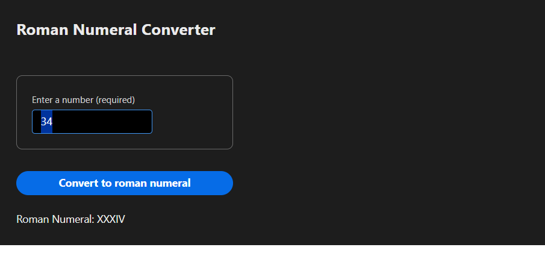
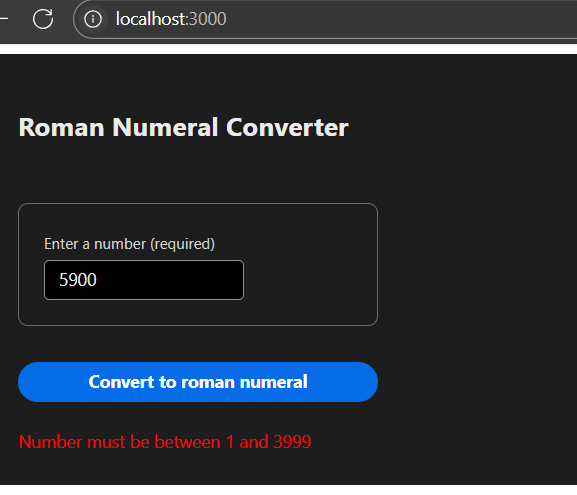

# Full Stack Web Application for converting given Number to Roman Numeral

* Accepts an Integer between 0 and 3999
* Submit the number to backend api for converting to roman numeral 
* It either displays roman numeral or error 
* Using Java + SpringBoot application for the api 
* Used spring-boot-starter-web, spring-boot-starter-test, lombok to reduce boilerplate code, loggers 
* Fully dockerized: run the entire application with single command

   
    
    docker compose up --build

### Prerequisites:
* Java 17
* npm
* docker desktop

### User Interface details
Front end code is under the folder <B>roman-numeral</B> 
Adobe react spectrum components are used for the Form fields and colorScheme

#### Testing UI
Run following command to start app on your local machine.
    
    cd roman-numeral
    npm install
    npm start
This will start the frontend/UI on port `3000`, available at http://localhost:3000    


### Backend details
Backend application is under the folder <B>roman-numeral-api</B>

#### Testing roman-numeral-api 

Run following main class to start API locally from any IDE
 "RomanNumeralApiApplication.java" class 

Use below curl command in a new terminal window to test the API locally
   ```curl --request GET \
   --url 'http://localhost:8080/api/romannumeral?input=4600' \
   --header 'User-Agent: insomnia/11.3.0'
   ```

# Running the application in Docker #
1. In Terminal, navigate to the project folder and run ```docker compose up --build```
2. Open browser, navigate to url: http://localhost:3000. This should open the UI for Roman Numeral Convertor.




